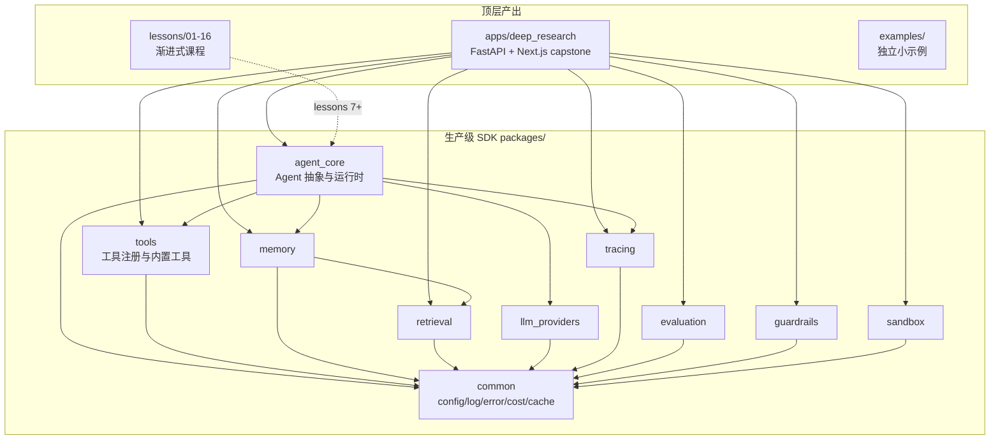

# 架构总览

本文档是仓库架构的**导航页**。完整设计参见 [设计文档](./superpowers/specs/2026-06-17-agent-task-design.md)。

## 仓库分层

## 关键原则

1. **packages 单向依赖**：`packages/*` 不依赖 `lessons/*` 或 `apps/*`。
2. **lessons 1–6 独立**：不依赖 `packages/`，专注讲清概念本质。第 7 章起开始引入 packages。
3. **State 用 TypedDict**（不用 Pydantic）：LangGraph 官方推荐，性能 + reducer 机制契合。Pydantic 仅用于跨进程边界。
4. **自定义事件层**：`agent_core/events.py` 把 LangGraph raw events 转成语义事件 → SSE → Vercel AI SDK，前后端契约解耦。
5. **多 provider 抽象**：默认 DeepSeek，一行配置可切 Claude / OpenAI / Ollama。

## 详细设计

完整章节大纲、各 package 内部结构、ADR 决策记录请参阅 [`docs/superpowers/specs/2026-06-17-agent-task-design.md`](./superpowers/specs/2026-06-17-agent-task-design.md)。

## 当前进展

参见根 [README 实施路线图](../README.md#实施路线图)。
