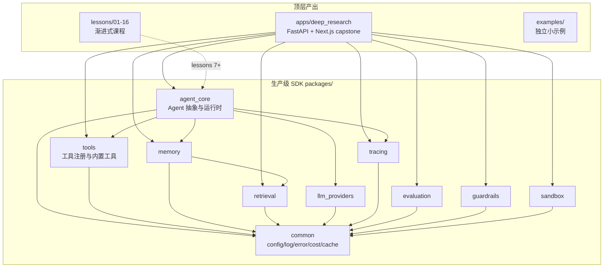

# M0 仓库基础设施实施计划

> **For agentic workers:** REQUIRED SUB-SKILL: Use superpowers:subagent-driven-development (recommended) or superpowers:executing-plans to implement this plan task-by-task. Steps use checkbox (`- [ ]`) syntax for tracking.

**Goal:** 搭好 AgentTask 仓库的工程化骨架——目录结构、`uv` workspace、Makefile、lint/type/test 配置、pre-commit、docker-compose（Postgres + Qdrant + Redis）、CI 三个 workflow（先空跑）、根 README 草稿、`.devcontainer/`、IDE 配置，以及 `docs/prerequisites/python-for-js-devs.md` 速查文档全文。

**Architecture:** Python 3.12 + `uv` monorepo workspace（对应 pnpm workspace），三个 workspace 目录 `packages/*`、`apps/*`、`lessons/*`（lessons 不在 workspace 内，独立可运行）。所有日常命令走 Makefile。GitHub Actions 三个 workflow（`ci.yml`、`eval-gate.yml`、`release.yml`）在 M0 阶段先空跑出绿色，具体内容由后续里程碑填充。

**Tech Stack:** Python 3.12, `uv`, `ruff`, `mypy`, `pytest`, `pre-commit`, `commitizen`, `detect-secrets`, Docker + docker-compose, Postgres 16 + pgvector, Qdrant, Redis 7, MkDocs Material, GitHub Actions。

**前置条件检查（执行者动手前确认）：**
1. 工作目录为 `/Users/temptrip/Documents/GitHub/AgentTask`，目录已存在但仅含 `docs/`（spec + plans）和 `.git/`（首次 commit `5c1f462` 是 spec）。
2. macOS（spec 信息），假设执行者已装 `git`。
3. 本计划中所有 commit message 一律中文，遵循 Conventional Commits 规范（`feat:` / `fix:` / `docs:` / `chore:` / `ci:` / `build:` / `test:`）。
4. 本计划中"运行某命令"的 expected output 描述以"关键特征"为准，不要求字符级一致——执行者用判断力确认是否达标。

---

## File Structure（M0 阶段产出的全部文件）

**根目录顶层文件：**
- Create: `pyproject.toml` —— uv workspace root + 顶层开发依赖（ruff/mypy/pytest/pre-commit/commitizen/detect-secrets/mkdocs）
- Create: `.python-version` —— 固定 `3.12`
- Create: `uv.lock` —— `uv sync` 生成
- Create: `.gitignore` —— Python + Node + IDE + 环境
- Create: `.dockerignore`
- Create: `.env.example` —— 环境变量模板（M0 阶段先列基础键，后续里程碑补充）
- Create: `ruff.toml` —— lint + format 配置
- Create: `mypy.ini` —— 类型检查配置
- Create: `.pre-commit-config.yaml`
- Create: `.secrets.baseline` —— detect-secrets baseline（首次扫描后生成）
- Create: `.cz.toml` —— commitizen 中文配置
- Create: `Makefile`
- Create: `docker-compose.yml`
- Create: `LICENSE` —— MIT
- Create: `README.md` —— 根 README 草稿
- Create: `CONTRIBUTING.md`
- Create: `SECURITY.md`
- Create: `.editorconfig`

**目录骨架（每个目录至少一个 `.gitkeep` 或 README，避免空目录被忽略）：**
- Create: `packages/.gitkeep`
- Create: `apps/.gitkeep`
- Create: `lessons/.gitkeep`
- Create: `examples/.gitkeep`
- Create: `scripts/.gitkeep`

**文档目录：**
- Create: `docs/prerequisites/python-for-js-devs.md` —— JS/TS ↔ Python 速查文档全文
- Create: `docs/architecture.md` —— 架构总览（M0 阶段写"骨架版"，引用 spec）
- Create: `docs/concepts/.gitkeep`
- Create: `mkdocs.yml` —— MkDocs Material 配置

**IDE / 编辑器配置：**
- Create: `.vscode/settings.json`
- Create: `.vscode/extensions.json`
- Create: `.devcontainer/devcontainer.json`
- Create: `.devcontainer/Dockerfile`

**GitHub 配置：**
- Create: `.github/pull_request_template.md`
- Create: `.github/workflows/ci.yml`
- Create: `.github/workflows/eval-gate.yml`
- Create: `.github/workflows/release.yml`
- Create: `.github/dependabot.yml`

**初始化脚本（占位）：**
- Create: `scripts/init_db.py` —— 初始化 Postgres schema 的占位脚本（M0 阶段只做"能 import + 退出 0"）
- Create: `tests/test_smoke.py` —— 仓库级别 smoke test

**总文件数：约 35 个。**

---

## Task 1：初始化 `uv` 工作区与 Python 版本

**Files:**
- Create: `pyproject.toml`
- Create: `.python-version`

- [ ] **Step 1.1：写 `.python-version`**

Create `.python-version`：

```
3.12
```

- [ ] **Step 1.2：写根 `pyproject.toml`**

Create `pyproject.toml`：

```toml
[project]
name = "agent-task"
version = "0.0.1"
description = "面向零基础前端工程师的 Agent 开发渐进式课程仓库（生产级 SDK + Capstone Deep Research Agent）"
readme = "README.md"
requires-python = ">=3.12,<3.13"
license = { text = "MIT" }
authors = [{ name = "AgentTask Author" }]

# 顶层 project 自身不暴露代码，仅作为 workspace 根。
# packages/* 与 apps/* 为子 workspace 成员，由各自 pyproject.toml 管理依赖。

[dependency-groups]
dev = [
    "ruff>=0.8.0",
    "mypy>=1.13",
    "pytest>=8.3",
    "pytest-asyncio>=0.24",
    "pytest-cov>=6.0",
    "pre-commit>=4.0",
    "commitizen>=4.0",
    "detect-secrets>=1.5",
    "mkdocs-material>=9.5",
    "mkdocs>=1.6",
]

[tool.uv.workspace]
members = ["packages/*", "apps/*"]

[tool.uv]
package = false  # 根项目本身不打包

[tool.pytest.ini_options]
asyncio_mode = "auto"
testpaths = ["tests", "packages", "apps"]
markers = [
    "fast: 毫秒级单元测试,pre-commit hook 会跑",
    "integration: 需要 docker 服务（Postgres/Qdrant/Redis）",
    "llm: 需要真实 LLM 调用,默认跳过,仅 make eval 时跑",
    "slow: 慢速测试（>5s）",
]
addopts = "-ra --strict-markers --strict-config"

[tool.coverage.run]
branch = true
source = ["packages", "apps"]

[tool.coverage.report]
show_missing = true
skip_covered = false
```

- [ ] **Step 1.3：运行 `uv sync` 生成 lock 文件**

```bash
cd /Users/temptrip/Documents/GitHub/AgentTask
uv sync
```

Expected：
- 自动安装 Python 3.12（如未安装）
- 创建 `.venv/`
- 生成 `uv.lock`
- 安装 dev group 的所有依赖

- [ ] **Step 1.4：验证 uv 与依赖安装成功**

```bash
uv run python --version
uv run ruff --version
uv run mypy --version
uv run pytest --version
```

Expected：四条命令均输出版本号且无报错；Python 输出形如 `Python 3.12.x`。

- [ ] **Step 1.5：写 `.gitignore`**

Create `.gitignore`：

```gitignore
# Python
__pycache__/
*.py[cod]
*$py.class
*.so
.Python
.venv/
venv/
ENV/
env/
*.egg-info/
.eggs/
build/
dist/
.pytest_cache/
.mypy_cache/
.ruff_cache/
.coverage
.coverage.*
htmlcov/
coverage.xml
.tox/

# Node
node_modules/
.next/
.turbo/
out/

# IDE
.idea/
*.swp
*.swo
.DS_Store

# 环境
.env
.env.local
.env.*.local
!.env.example

# uv
# uv.lock 应提交以保证可复现构建（与 pnpm-lock.yaml 同义）

# Jupyter
.ipynb_checkpoints/

# 文档构建
site/

# Docker volumes（本地开发数据持久化目录）
.docker-data/

# 评估结果缓存
.eval-cache/

# 日志
*.log

# OS
Thumbs.db
```

- [ ] **Step 1.6：写 `.dockerignore`**

Create `.dockerignore`：

```
.git/
.venv/
node_modules/
.next/
__pycache__/
.pytest_cache/
.mypy_cache/
.ruff_cache/
.coverage
.docker-data/
.eval-cache/
*.log
.env
.env.local
docs/
*.md
```

- [ ] **Step 1.7：提交**

```bash
git add .python-version pyproject.toml uv.lock .gitignore .dockerignore
git commit -m "chore: 初始化 uv 工作区与 Python 3.12 版本固定"
```

---

## Task 2：写 ruff、mypy 配置

**Files:**
- Create: `ruff.toml`
- Create: `mypy.ini`

- [ ] **Step 2.1：写 `ruff.toml`**

Create `ruff.toml`：

```toml
# 大厂内部 lint 配置参考。lessons 早期章节通过 per-file-ignores 放宽。

target-version = "py312"
line-length = 100
indent-width = 4

extend-exclude = [
    ".venv",
    "build",
    "dist",
    "site",
    "**/.ipynb_checkpoints",
]

[lint]
select = [
    "E",    # pycodestyle errors
    "W",    # pycodestyle warnings
    "F",    # pyflakes
    "I",    # isort
    "N",    # pep8-naming
    "UP",   # pyupgrade
    "B",    # flake8-bugbear
    "A",    # flake8-builtins
    "C4",   # flake8-comprehensions
    "SIM",  # flake8-simplify
    "RUF",  # ruff-specific
    "ASYNC", # flake8-async
    "S",    # flake8-bandit（安全相关）
    "T20",  # flake8-print（禁止生产代码 print）
    "PTH",  # flake8-use-pathlib
    "RET",  # flake8-return
    "ARG",  # flake8-unused-arguments
    "PL",   # pylint（精选规则）
]

ignore = [
    "E501",     # 行长度由 formatter 处理
    "S101",     # 允许 assert（pytest 需要）
    "PLR0913",  # 函数参数过多（agent 配置类经常超）
    "PLR2004",  # magic value（教学代码常见）
    "B008",     # 函数默认值调用（FastAPI Depends 模式）
    "RUF002",   # 中文标点（中文文档需要）
    "RUF003",   # 中文注释里的英文标点
]

[lint.per-file-ignores]
# 测试文件放宽
"**/tests/**" = ["S", "PL", "ARG", "T20"]
"**/test_*.py" = ["S", "PL", "ARG", "T20"]
# Notebook 不限制 print
"**/*.ipynb" = ["T20", "F401", "F811"]
# lessons 早期章节允许 print 和教学风格
"lessons/01-*/**" = ["T20", "PL"]
"lessons/02-*/**" = ["T20", "PL"]
"lessons/03-*/**" = ["T20", "PL"]
# 脚本允许 print
"scripts/**" = ["T20"]

[lint.isort]
known-first-party = ["agent_core", "common", "llm_providers", "tools", "memory", "retrieval", "tracing", "evaluation", "guardrails", "sandbox"]

[lint.pydocstyle]
convention = "google"

[format]
quote-style = "double"
indent-style = "space"
docstring-code-format = true
```

- [ ] **Step 2.2：写 `mypy.ini`**

Create `mypy.ini`：

```ini
[mypy]
python_version = 3.12
strict = True
warn_unused_configs = True
warn_redundant_casts = True
warn_unused_ignores = True
disallow_any_generics = True
check_untyped_defs = True
no_implicit_reexport = True
show_error_codes = True
pretty = True

# 排除目录
exclude = (?x)(
    \.venv/
    | build/
    | dist/
    | site/
    | \.ipynb_checkpoints/
)

# lessons 早期章节放宽（教学代码不强制 strict）
[mypy-lessons.01-*.*]
disallow_untyped_defs = False
strict = False

[mypy-lessons.02-*.*]
disallow_untyped_defs = False
strict = False

[mypy-lessons.03-*.*]
disallow_untyped_defs = False
strict = False

# 第三方库类型存根缺失时忽略
[mypy-langgraph.*]
ignore_missing_imports = True

[mypy-langchain.*]
ignore_missing_imports = True

[mypy-langchain_core.*]
ignore_missing_imports = True

[mypy-langchain_openai.*]
ignore_missing_imports = True

[mypy-langchain_anthropic.*]
ignore_missing_imports = True

[mypy-langchain_community.*]
ignore_missing_imports = True

[mypy-qdrant_client.*]
ignore_missing_imports = True

[mypy-tavily.*]
ignore_missing_imports = True

[mypy-trafilatura.*]
ignore_missing_imports = True

[mypy-readability.*]
ignore_missing_imports = True

[mypy-e2b.*]
ignore_missing_imports = True

[mypy-mcp.*]
ignore_missing_imports = True
```

- [ ] **Step 2.3：验证 ruff 与 mypy 在空仓库上能跑**

```bash
uv run ruff check .
uv run ruff format --check .
uv run mypy . || true  # 空仓库可能没有可检查的源文件
```

Expected：
- `ruff check .`：`All checks passed!`
- `ruff format --check .`：`X files already formatted`
- `mypy .`：可能输出 `Success: no issues found` 或 `There are no .py[i] files in directory '.'`，前者更常见。

- [ ] **Step 2.4：提交**

```bash
git add ruff.toml mypy.ini
git commit -m "chore: 配置 ruff（lint + format）与 mypy --strict 类型检查"
```

---

## Task 3：写 commitizen、pre-commit、detect-secrets 配置

**Files:**
- Create: `.cz.toml`
- Create: `.pre-commit-config.yaml`
- Create: `.secrets.baseline`

- [ ] **Step 3.1：写 `.cz.toml`（commitizen 中文配置）**

Create `.cz.toml`：

```toml
[tool.commitizen]
name = "cz_conventional_commits"
version = "0.0.1"
version_files = [
    "pyproject.toml:^version",
]
tag_format = "v$version"
update_changelog_on_bump = true
changelog_incremental = true
changelog_file = "CHANGELOG.md"
bump_message = "chore(release): 版本 $current_version → $new_version"

# 我们使用英文的 type 前缀（feat/fix/docs/chore/...），但 description 用中文。
# 例: feat(agent_core): 添加 ReAct 模式 graph 模板
```

- [ ] **Step 3.2：写 `.pre-commit-config.yaml`**

Create `.pre-commit-config.yaml`：

```yaml
# 4 道闸,目标在 5 秒内完成。
# 真实 LLM 调用类的测试不在这里跑（贵+慢），放在 CI 的独立 job。

default_language_version:
  python: python3.12

repos:
  # 1. ruff: lint + format autofix
  - repo: https://github.com/astral-sh/ruff-pre-commit
    rev: v0.8.4
    hooks:
      - id: ruff
        args: [--fix, --exit-non-zero-on-fix]
      - id: ruff-format

  # 2. mypy: 仅检查改动的包
  - repo: https://github.com/pre-commit/mirrors-mypy
    rev: v1.13.0
    hooks:
      - id: mypy
        additional_dependencies:
          - pydantic>=2.0
        args: [--config-file=mypy.ini]
        # 通过 files 限制只跑改动文件,加速
        exclude: ^(\.venv|build|dist|site|.*\.ipynb_checkpoints)

  # 3. pytest -m fast: 只跑被 import 影响的快速测试
  - repo: local
    hooks:
      - id: pytest-fast
        name: pytest-fast
        entry: uv run pytest -m fast --no-header -q
        language: system
        pass_filenames: false
        stages: [pre-commit]
        # 失败时显示输出,但不重复跑
        always_run: false

  # 4. detect-secrets: 扫描 .env/key 误提交
  - repo: https://github.com/Yelp/detect-secrets
    rev: v1.5.0
    hooks:
      - id: detect-secrets
        args: [--baseline, .secrets.baseline]
        exclude: ^(uv\.lock|package-lock\.json|pnpm-lock\.yaml)$

  # 通用文件检查
  - repo: https://github.com/pre-commit/pre-commit-hooks
    rev: v5.0.0
    hooks:
      - id: trailing-whitespace
      - id: end-of-file-fixer
      - id: check-yaml
      - id: check-toml
      - id: check-added-large-files
        args: [--maxkb=500]
      - id: check-merge-conflict
      - id: detect-private-key

  # commitizen: 校验 commit message
  - repo: https://github.com/commitizen-tools/commitizen
    rev: v4.0.0
    hooks:
      - id: commitizen
        stages: [commit-msg]
```

- [ ] **Step 3.3：生成 detect-secrets baseline**

```bash
uv run detect-secrets scan > .secrets.baseline
```

Expected：生成 `.secrets.baseline` 文件（JSON），无密钥发现时 `results` 为空。

- [ ] **Step 3.4：安装 pre-commit hooks**

```bash
uv run pre-commit install --install-hooks
uv run pre-commit install --hook-type commit-msg
```

Expected：两条命令分别安装 pre-commit hook 与 commit-msg hook。

- [ ] **Step 3.5：在所有现存文件上跑一次 pre-commit**

```bash
uv run pre-commit run --all-files
```

Expected：可能有 `trailing-whitespace` / `end-of-file-fixer` 自动修复（这是 hook 第一次跑的正常现象）。如自动修复了文件，重新 `git add` 并再跑一次。`pytest-fast` 这一步因尚无测试文件应直接通过。

- [ ] **Step 3.6：提交**

```bash
git add .cz.toml .pre-commit-config.yaml .secrets.baseline
git commit -m "chore: 配置 commitizen 与 pre-commit 4 道闸（ruff/mypy/pytest-fast/secrets）"
```

提交时 commitizen hook 会校验 commit message 格式。如失败请按 conventional commits 格式调整。

---

## Task 4：写 Makefile

**Files:**
- Create: `Makefile`

- [ ] **Step 4.1：写 `Makefile`**

Create `Makefile`：

```makefile
# AgentTask 仓库统一命令入口
# 设计原则: 学习者只需记 6-7 个动词,不用记 uv 长串命令

.PHONY: help setup up down restart logs lint format type test test-fast eval eval-gate notebook capstone-dev clean docs-serve docs-build precommit-all

# 默认目标: 列出所有命令
help:
	@echo "AgentTask 常用命令:"
	@echo ""
	@echo "  make setup          首次安装: 装 uv → uv sync → pre-commit install → docker compose up"
	@echo "  make up             起 docker 服务（Postgres + Qdrant + Redis）"
	@echo "  make down           停 docker 服务"
	@echo "  make restart        重启 docker 服务"
	@echo "  make logs           查看 docker 服务日志"
	@echo ""
	@echo "  make lint           ruff 检查（不修复）"
	@echo "  make format         ruff 自动修复 + format"
	@echo "  make type           mypy 类型检查"
	@echo "  make test           跑全量 pytest（不含 llm 标记）"
	@echo "  make test-fast      只跑 fast 标记的快速测试"
	@echo "  make precommit-all  在所有文件上跑 pre-commit"
	@echo ""
	@echo "  make eval           跑 evaluation 套件（消耗 LLM 额度）"
	@echo "  make eval-gate      CI 评估门: 跑 eval 并对比基线"
	@echo ""
	@echo "  make notebook       启动 Jupyter Lab"
	@echo "  make capstone-dev   启动 capstone 全栈开发环境"
	@echo ""
	@echo "  make docs-serve     本地预览文档站（mkdocs）"
	@echo "  make docs-build     构建文档站（CI 用）"
	@echo ""
	@echo "  make clean          清理缓存与测试产物"

# ----- 安装与服务 -----

setup:
	@which uv >/dev/null || (echo "请先安装 uv: https://docs.astral.sh/uv/getting-started/installation/" && exit 1)
	uv sync
	uv run pre-commit install --install-hooks
	uv run pre-commit install --hook-type commit-msg
	@echo ""
	@echo "✓ 依赖与 hooks 安装完成"
	@echo "→ 运行 'make up' 启动 docker 服务"
	@echo "→ 运行 'make test' 验证安装"

up:
	docker compose up -d
	@echo "✓ docker 服务已启动"
	@echo "  Postgres: localhost:5432"
	@echo "  Qdrant:   localhost:6333"
	@echo "  Redis:    localhost:6379"

down:
	docker compose down

restart: down up

logs:
	docker compose logs -f --tail=100

# ----- 代码质量 -----

lint:
	uv run ruff check .

format:
	uv run ruff check --fix .
	uv run ruff format .

type:
	uv run mypy .

test:
	uv run pytest -m "not llm"

test-fast:
	uv run pytest -m fast

precommit-all:
	uv run pre-commit run --all-files

# ----- 评估 -----

eval:
	@echo "M0 阶段 evaluation 框架尚未实现，此命令将在 M4 后可用"
	@exit 0

eval-gate:
	@echo "M0 阶段 eval-gate 框架尚未实现，此命令将在 M4 后可用"
	@exit 0

# ----- 开发服务 -----

notebook:
	@which jupyter >/dev/null 2>&1 || (echo "请先安装: uv add --dev jupyterlab" && exit 1)
	uv run jupyter lab

capstone-dev:
	@echo "M5 阶段 capstone 尚未实现，此命令将在 M5 后可用"
	@exit 0

# ----- 文档 -----

docs-serve:
	uv run mkdocs serve

docs-build:
	uv run mkdocs build --strict

# ----- 清理 -----

clean:
	find . -type d -name __pycache__ -exec rm -rf {} + 2>/dev/null || true
	find . -type d -name .pytest_cache -exec rm -rf {} + 2>/dev/null || true
	find . -type d -name .mypy_cache -exec rm -rf {} + 2>/dev/null || true
	find . -type d -name .ruff_cache -exec rm -rf {} + 2>/dev/null || true
	find . -type d -name .ipynb_checkpoints -exec rm -rf {} + 2>/dev/null || true
	rm -rf .coverage htmlcov coverage.xml site/
	@echo "✓ 缓存已清理（保留 .venv 与 docker volumes）"
```

- [ ] **Step 4.2：验证 Makefile**

```bash
make help
make lint
make type
```

Expected：
- `make help` 列出所有命令
- `make lint` 通过（`All checks passed!`）
- `make type` 通过

- [ ] **Step 4.3：提交**

```bash
git add Makefile
git commit -m "chore: 添加 Makefile 作为统一命令入口"
```

---

## Task 5：写 docker-compose.yml 与 `.env.example`

**Files:**
- Create: `docker-compose.yml`
- Create: `.env.example`

- [ ] **Step 5.1：写 `docker-compose.yml`**

Create `docker-compose.yml`：

```yaml
# AgentTask 本地开发服务
# 启动: make up
# 停止: make down
# 数据持久化: ./.docker-data/（已加入 .gitignore）

services:
  postgres:
    image: pgvector/pgvector:pg16
    container_name: agenttask-postgres
    restart: unless-stopped
    environment:
      POSTGRES_USER: ${POSTGRES_USER:-agenttask}
      POSTGRES_PASSWORD: ${POSTGRES_PASSWORD:-agenttask_dev}
      POSTGRES_DB: ${POSTGRES_DB:-agenttask}
      PGDATA: /var/lib/postgresql/data/pgdata
    ports:
      - "${POSTGRES_PORT:-5432}:5432"
    volumes:
      - ./.docker-data/postgres:/var/lib/postgresql/data
    healthcheck:
      test: ["CMD-SHELL", "pg_isready -U ${POSTGRES_USER:-agenttask}"]
      interval: 5s
      timeout: 3s
      retries: 10

  qdrant:
    image: qdrant/qdrant:v1.12.4
    container_name: agenttask-qdrant
    restart: unless-stopped
    ports:
      - "${QDRANT_HTTP_PORT:-6333}:6333"
      - "${QDRANT_GRPC_PORT:-6334}:6334"
    volumes:
      - ./.docker-data/qdrant:/qdrant/storage
    healthcheck:
      test: ["CMD-SHELL", "bash -c ':> /dev/tcp/127.0.0.1/6333' || exit 1"]
      interval: 5s
      timeout: 3s
      retries: 10

  redis:
    image: redis:7-alpine
    container_name: agenttask-redis
    restart: unless-stopped
    ports:
      - "${REDIS_PORT:-6379}:6379"
    volumes:
      - ./.docker-data/redis:/data
    command: ["redis-server", "--save", "60", "1", "--loglevel", "warning"]
    healthcheck:
      test: ["CMD", "redis-cli", "ping"]
      interval: 5s
      timeout: 3s
      retries: 10

# SigNoz / Jaeger 等可观测性服务由 M4 里程碑按需添加（profile: observability）
```

- [ ] **Step 5.2：写 `.env.example`**

Create `.env.example`：

```dotenv
# AgentTask 环境变量模板
# 用法: cp .env.example .env 然后填入真实值
# .env 已在 .gitignore 中,不会被提交

# ===== LLM Provider Keys =====
# 至少配置一个。默认使用 DeepSeek。
DEEPSEEK_API_KEY=
# DeepSeek 兼容 OpenAI API,base_url 固定为下方值
DEEPSEEK_BASE_URL=https://api.deepseek.com

# 可选: 其他 provider（多供应商抽象层支持切换）
ANTHROPIC_API_KEY=
OPENAI_API_KEY=
OLLAMA_BASE_URL=http://localhost:11434

# ===== 工具 API =====
# Tavily 搜索（每月 1000 次免费）: https://tavily.com
TAVILY_API_KEY=

# ===== 数据库 / 缓存 / 向量库 =====
# 与 docker-compose.yml 默认值对齐
POSTGRES_USER=agenttask
POSTGRES_PASSWORD=agenttask_dev
POSTGRES_DB=agenttask
POSTGRES_HOST=localhost
POSTGRES_PORT=5432

QDRANT_HOST=localhost
QDRANT_HTTP_PORT=6333
QDRANT_GRPC_PORT=6334

REDIS_HOST=localhost
REDIS_PORT=6379

# ===== 可观测性（M4 后启用）=====
LANGSMITH_TRACING=false
LANGSMITH_API_KEY=
LANGSMITH_PROJECT=agent-task

# OpenTelemetry（自托管 SigNoz/Jaeger 时使用）
OTEL_EXPORTER_OTLP_ENDPOINT=
OTEL_SERVICE_NAME=agent-task

# ===== 应用环境 =====
APP_ENV=dev  # dev | staging | prod
LOG_LEVEL=INFO
```

- [ ] **Step 5.3：验证 docker-compose 配置正确**

```bash
docker compose config
```

Expected：输出展开后的 YAML，无报错。

- [ ] **Step 5.4：起服务并验证健康检查**

```bash
make up
sleep 15
docker compose ps
```

Expected：三个服务（postgres、qdrant、redis）均为 `Up` 且健康（Status 含 `healthy`）。如某服务不健康，先 `make logs` 看日志再排查。

- [ ] **Step 5.5：停服务**

```bash
make down
```

Expected：三个容器停止并移除（卷数据保留在 `./.docker-data/`）。

- [ ] **Step 5.6：提交**

```bash
git add docker-compose.yml .env.example
git commit -m "build: 添加 docker-compose（Postgres+pgvector / Qdrant / Redis）与环境变量模板"
```

---

## Task 6：写 LICENSE、CONTRIBUTING、SECURITY、`.editorconfig`

**Files:**
- Create: `LICENSE`
- Create: `CONTRIBUTING.md`
- Create: `SECURITY.md`
- Create: `.editorconfig`

- [ ] **Step 6.1：写 `LICENSE`（MIT）**

Create `LICENSE`：

```
MIT License

Copyright (c) 2026 AgentTask Author

Permission is hereby granted, free of charge, to any person obtaining a copy
of this software and associated documentation files (the "Software"), to deal
in the Software without restriction, including without limitation the rights
to use, copy, modify, merge, publish, distribute, sublicense, and/or sell
copies of the Software, and to permit persons to whom the Software is
furnished to do so, subject to the following conditions:

The above copyright notice and this permission notice shall be included in all
copies or substantial portions of the Software.

THE SOFTWARE IS PROVIDED "AS IS", WITHOUT WARRANTY OF ANY KIND, EXPRESS OR
IMPLIED, INCLUDING BUT NOT LIMITED TO THE WARRANTIES OF MERCHANTABILITY,
FITNESS FOR A PARTICULAR PURPOSE AND NONINFRINGEMENT. IN NO EVENT SHALL THE
AUTHORS OR COPYRIGHT HOLDERS BE LIABLE FOR ANY CLAIM, DAMAGES OR OTHER
LIABILITY, WHETHER IN AN ACTION OF CONTRACT, TORT OR OTHERWISE, ARISING FROM,
OUT OF OR IN CONNECTION WITH THE SOFTWARE OR THE USE OR OTHER DEALINGS IN THE
SOFTWARE.
```

- [ ] **Step 6.2：写 `CONTRIBUTING.md`**

Create `CONTRIBUTING.md`：

```markdown
# 贡献指南

感谢你考虑为 AgentTask 项目贡献代码。

本仓库的主要定位是教学项目，但同样欢迎社区贡献：修复 bug、改进文档、补充练习题、增加新章节示例。

## 开发环境

参见根 README 的"快速开始"。一条 `make setup` 即可完成全部环境准备。

## 提交流程

1. Fork 仓库 → 在自己仓库的 `main` 分支基础上拉特性分支：
   - `feat/xxx` 新功能
   - `fix/xxx` Bug 修复
   - `docs/xxx` 文档改动
   - `chore/xxx` 杂项
   - `lesson/0X-yyy` 章节内容
2. 提交前请确保：
   - `make lint` 通过
   - `make type` 通过
   - `make test` 通过
   - 改动 `packages/` 或 `apps/` 时请补充测试
3. Commit message 遵循 [Conventional Commits](https://www.conventionalcommits.org/)，描述使用中文：
   - `feat(agent_core): 添加 ReAct 模式 graph 模板`
   - `fix(retrieval): 修复 Qdrant 客户端连接超时`
   - `docs: 修正第 4 章 README 错别字`
4. 提交 PR 时请填写 PR 模板的 checklist。

## 章节贡献规范

新增 `lessons/` 章节时，目录结构需遵循：

```
lessons/0X-章节名/
├── README.md         # 中文讲解
├── notebook.ipynb    # 交互式探索（前期主导）
├── src/              # 可运行 .py 代码
├── tests/            # 配套测试
├── exercises/        # 练习题
├── solutions/        # 答案
└── NOTES.md          # 学习总结
```

## 行为准则

请遵守 [Contributor Covenant](https://www.contributor-covenant.org/) 行为准则。

```

- [ ] **Step 6.3：写 `SECURITY.md`**

Create `SECURITY.md`：

```markdown
# 安全策略

## 报告漏洞

如果你发现了安全漏洞，**请不要在公开 issue 中讨论**。

请通过私下渠道联系仓库维护者：
- 在 GitHub 上发起 Private Vulnerability Report（推荐）
- 或邮件至维护者（如仓库 README 中列出）

我们会在 7 个工作日内回复，并与你协调修复时间表。

## 支持的版本

仅 `main` 分支 + 最新发布的 minor 版本接受安全更新。

## 密钥管理

本仓库严格禁止提交以下内容：
- API keys（DeepSeek / Anthropic / OpenAI / Tavily / LangSmith 等）
- 数据库密码
- `.env` 文件

`pre-commit` 配置了 `detect-secrets` 自动扫描；CI 也会做二次校验。如不慎提交，请立即旋转密钥，并通过 `git filter-repo` 清理历史。

## 工具调用与沙箱

`packages/sandbox/`（M4 阶段实现）提供 E2B + Docker 两种代码执行沙箱方案。生产场景下：
- 默认禁用 `python_repl` / `shell` 等高危工具
- 高危工具调用强制走 HITL 审批（`packages/agent_core/interrupt`）
- 沙箱默认无网络访问，需显式白名单
```

- [ ] **Step 6.4：写 `.editorconfig`**

Create `.editorconfig`：

```ini
# 跨编辑器基础格式统一
# https://editorconfig.org/

root = true

[*]
charset = utf-8
end_of_line = lf
insert_final_newline = true
trim_trailing_whitespace = true
indent_style = space
indent_size = 4

[*.{js,jsx,ts,tsx,json,yml,yaml,md}]
indent_size = 2

[*.{toml,ini}]
indent_size = 4

[Makefile]
indent_style = tab

[*.md]
trim_trailing_whitespace = false  # markdown 行尾两空格 = 软换行
```

- [ ] **Step 6.5：跑 pre-commit 验证**

```bash
uv run pre-commit run --files LICENSE CONTRIBUTING.md SECURITY.md .editorconfig
```

Expected：所有 hook 通过（可能 `end-of-file-fixer` 自动修复，重新 add 即可）。

- [ ] **Step 6.6：提交**

```bash
git add LICENSE CONTRIBUTING.md SECURITY.md .editorconfig
git commit -m "docs: 添加 LICENSE（MIT）/ CONTRIBUTING / SECURITY 与 editorconfig"
```

---

## Task 7：写根 `README.md`（M0 草稿版）

**Files:**
- Create: `README.md`

- [ ] **Step 7.1：写 `README.md`**

Create `README.md`：

```markdown
# AgentTask · 从零基础到 Agent 工程师

> 一个面向**有数年前端经验、零 Python / 零 LLM 经验**的高级工程师，从零学习 Agent 开发并产出生产级作品的渐进式课程仓库。

[](https://github.com/USERNAME/AgentTask/actions/workflows/ci.yml)
[](https://github.com/USERNAME/AgentTask/actions/workflows/eval-gate.yml)
[](LICENSE)
[](https://www.python.org/downloads/release/python-3120/)
[](https://github.com/astral-sh/uv)

> ⚠️ **当前状态：M0（仓库基础设施）开发中**。课程内容与 `packages/` SDK 将随后续里程碑陆续上线。详见[实施路线图](#实施路线图)。

---

## 这是什么

- ✅ **是**：一份从"零 Python 基础"到"能独立交付生产级 Agent 系统"的完整学习路径，含 16 章渐进式课程 + 9 个生产级 SDK 包 + 一个 Deep Research Agent capstone。
- ✅ **是**：一份大厂级工程化样板（`uv` + `ruff` + `mypy --strict` + `pytest` + `pre-commit` + GitHub Actions + LangSmith + OpenTelemetry + Docker）。
- ✅ **是**：作者的简历项目——证明"我能从零学懂 Agent 开发并产出生产级作品"。

- ❌ **不是**：模型训练 / fine-tuning 教程。
- ❌ **不是**：K8s / Helm / 多环境 CI/CD（属于平台工程师范畴）。
- ❌ **不是**：博客 / 视频教程的代码附件。

## 读者地图

仓库面向三类读者，每类有自己的入口：

| 读者类型 | 推荐路径 |
|---|---|
| 🌱 **零基础学习者** | 根 README → [`docs/prerequisites/python-for-js-devs.md`](./docs/prerequisites/python-for-js-devs.md) → `lessons/01-foundations/`（M2 后上线） |
| 🛠 **中级开发者直接看 SDK 设计** | 根 README → [`docs/architecture.md`](./docs/architecture.md) → `packages/agent_core/`（M2 后上线） |
| 👔 **面试官/HR** | 根 README → capstone 截图 / GIF → `apps/deep_research/`（M5 后上线） → `docs/job-prep.md`（M6 后上线） |

## 课程地图（计划）

| 章节 | 主题 | 状态 |
|---|---|---|
| 01 | LLM 基础 + Python/uv 入门 | ⏳ M2 |
| 02 | Prompting 与结构化输出 | ⏳ M2 |
| 03 | Tool Use 工具调用 | ⏳ M2 |
| 04 | ReAct 模式 | ⏳ M2 |
| 05 | Plan-and-Execute | ⏳ M2 |
| 06 | Reflection / Reflexion | ⏳ M2 |
| 07 | Memory（短期 + 长期） | ⏳ M3 |
| 08 | RAG 基础 | ⏳ M3 |
| 09 | Agentic RAG（Self-RAG / Corrective-RAG） | ⏳ M3 |
| 10 | Multi-Agent: Supervisor | ⏳ M3 |
| 11 | Multi-Agent 拓扑全景 | ⏳ M3 |
| 12 | Streaming 与 HITL | ⏳ M4 |
| 13 | Evaluation 与测试 | ⏳ M4 |
| 14 | Observability 与成本控制 | ⏳ M4 |
| 15 | MCP 与 A2A 协议 | ⏳ M4 |
| 16 | 部署、护栏与代码沙箱 | ⏳ M4 |
| 🚀 | **Capstone: Deep Research Agent** | ⏳ M5 |

## 技术栈一览

| 层 | 用了什么 | 对应 JS 生态 |
|---|---|---|
| 包管理 | `uv` + workspace | `pnpm` + workspace |
| Lint / Format | `ruff` | `eslint` + `prettier` |
| 类型 | `mypy --strict` | `tsc --strict` |
| 测试 | `pytest` + `pytest-asyncio` | `vitest` |
| Hook | `pre-commit` + `commitizen` | `husky` + `lint-staged` |
| 配置 | `pydantic-settings` | `zod` + `dotenv` |
| LLM 框架 | `langgraph` + `langchain` | (无对应) |
| 默认 LLM | DeepSeek（OpenAI 兼容） | - |
| 向量库 | Qdrant + pgvector | - |
| 数据库 | Postgres 16 + Redis 7 | - |
| API | FastAPI + SSE | Express / Hono |
| 前端（capstone） | Next.js 15 + React 19 + Vercel AI SDK | - |
| 容器 | Docker + docker-compose | - |
| CI | GitHub Actions | - |
| 文档 | MkDocs Material | - |

## 快速开始

### 前置要求

- macOS / Linux / Windows + WSL2
- [`uv`](https://docs.astral.sh/uv/getting-started/installation/)（一行安装：`curl -LsSf https://astral.sh/uv/install.sh | sh`）
- Docker Desktop（或 Linux 上的 Docker Engine）

### 5 行命令跑通

```bash
git clone https://github.com/USERNAME/AgentTask.git
cd AgentTask
cp .env.example .env  # 填入 DEEPSEEK_API_KEY
make setup            # 装依赖 + 配 hooks
make up               # 起 Postgres + Qdrant + Redis
make test             # 验证安装
```

### 进入 capstone（M5 后可用）

```bash
make capstone-dev     # 启动 FastAPI + Next.js
# 访问 http://localhost:3000
```

## 实施路线图

| 里程碑 | 内容 | 版本号 |
|---|---|---|
| **M0** | 仓库基础设施（当前阶段） | - |
| M1 | `packages/common` + `packages/llm_providers` | - |
| **M2** | lessons 1–6 + `tools` + `agent_core` | `v0.1.0` |
| M3 | lessons 7–11 + `memory` + `retrieval` + 多 agent | - |
| **M4** | lessons 12–16 + `tracing` + `evaluation` + `guardrails` + `sandbox` | `v0.2.0` |
| **M5** | Capstone Deep Research Agent | `v1.0.0` |
| M6 | `examples/` + 文档站 + 面试题清单 | - |

详细设计文档：[`docs/superpowers/specs/2026-06-17-agent-task-design.md`](./docs/superpowers/specs/2026-06-17-agent-task-design.md)

## 贡献

参见 [CONTRIBUTING.md](./CONTRIBUTING.md)。

## License

[MIT](./LICENSE)
```

- [ ] **Step 7.2：跑 pre-commit 验证**

```bash
uv run pre-commit run --files README.md
```

Expected：通过（可能末尾换行被自动修复）。

- [ ] **Step 7.3：提交**

```bash
git add README.md
git commit -m "docs: 添加根 README 草稿（M0 版本）"
```

---

## Task 8：创建目录骨架与首批 `.gitkeep`

**Files:**
- Create: `packages/.gitkeep`
- Create: `apps/.gitkeep`
- Create: `lessons/.gitkeep`
- Create: `examples/.gitkeep`
- Create: `scripts/.gitkeep`
- Create: `docs/concepts/.gitkeep`

- [ ] **Step 8.1：创建目录与占位文件**

```bash
mkdir -p packages apps lessons examples scripts docs/concepts
touch packages/.gitkeep apps/.gitkeep lessons/.gitkeep examples/.gitkeep scripts/.gitkeep docs/concepts/.gitkeep
```

- [ ] **Step 8.2：验证目录结构**

```bash
ls -la packages apps lessons examples scripts docs/concepts
```

Expected：每个目录存在且含 `.gitkeep`。

- [ ] **Step 8.3：提交**

```bash
git add packages/.gitkeep apps/.gitkeep lessons/.gitkeep examples/.gitkeep scripts/.gitkeep docs/concepts/.gitkeep
git commit -m "chore: 创建 packages/apps/lessons/examples/scripts 目录骨架"
```

---

## Task 9：写 `docs/prerequisites/python-for-js-devs.md` 速查文档

**Files:**
- Create: `docs/prerequisites/python-for-js-devs.md`

- [ ] **Step 9.1：写速查文档全文**

Create `docs/prerequisites/python-for-js-devs.md`：

```markdown
# Python for JS/TS Devs · 速查对照表

> 给数年前端经验、零 Python 基础的工程师。每条 Python 概念都映射到 JS/TS 的对应物，让你"用前端直觉学 Python"。
>
> 本文不求完整覆盖 Python 全部语法，只覆盖学习 Agent 开发**必需**的部分。需要更深入时再单独学。

## 0. 心智迁移：Python ↔ JS/TS 总图

| 维度 | JS/TS | Python |
|---|---|---|
| 包管理器 | `pnpm` / `npm` / `yarn` | **`uv`**（推荐）/ `pip` / `poetry` |
| 锁文件 | `pnpm-lock.yaml` | `uv.lock` |
| 项目清单 | `package.json` | `pyproject.toml` |
| 类型系统 | TypeScript | type hints + `mypy` |
| 类型校验时机 | 编译时（tsc） | 静态检查（mypy）；运行时不强制 |
| Schema 校验 | `zod` | `pydantic` |
| Lint + Format | `eslint` + `prettier` | `ruff`（一个工具搞定） |
| 测试 | `vitest` / `jest` | `pytest` |
| Async | `Promise` / `async/await` | `coroutine` / `async/await` |
| Hook 工具 | `husky` + `lint-staged` | `pre-commit` |
| 模块系统 | ESM `import` | `import` |
| 工作区 | pnpm workspace | uv workspace |
| Web 框架 | Express / Hono / Next API | FastAPI / Flask / Django |
| 运行时 | Node.js / Bun | CPython（标准 Python 解释器） |

## 1. 工具链：`uv` ≈ `pnpm`

### 安装 uv

```bash
curl -LsSf https://astral.sh/uv/install.sh | sh
```

### 常用命令对照

| 操作 | pnpm | uv |
|---|---|---|
| 装依赖 | `pnpm install` | `uv sync` |
| 加运行时依赖 | `pnpm add foo` | `uv add foo` |
| 加 dev 依赖 | `pnpm add -D foo` | `uv add --dev foo` |
| 删依赖 | `pnpm remove foo` | `uv remove foo` |
| 升级 | `pnpm update` | `uv lock --upgrade` |
| 跑脚本 | `pnpm run dev` | `uv run xxx` |
| 在虚拟环境跑 | (不需要) | `uv run python script.py` |
| 创建工作区 | `pnpm-workspace.yaml` | `[tool.uv.workspace]` in pyproject.toml |

**关键差异**：Python 默认全局共享解释器与依赖，因此每个项目需要"虚拟环境"（`.venv/`）。`uv` 会自动管理这个目录，你基本感知不到。`uv run` 等同于 `pnpm exec` + 自动激活虚拟环境。

## 2. 模块与导入

### JS/TS

```ts
import { foo, bar } from "./module";
import * as utils from "./utils";
import defaultExport from "./mod";
```

### Python

```python
from .module import foo, bar       # 相对导入
from package.module import foo     # 绝对导入
import package.utils as utils      # 整模块导入
# Python 没有 default export 概念
```

**关键差异**：
- Python 包靠目录里的 `__init__.py` 标识（现代 Python 3.3+ 也支持隐式命名空间包）。
- 相对导入用前导点：`.` = 同级，`..` = 上一级。
- 没有 `default export`——所有导出都是命名导出。

## 3. 类型系统：type hints ≈ TypeScript（但运行时不强制）

### JS/TS

```ts
function greet(name: string, age: number): string {
  return `${name} is ${age}`;
}

interface User {
  id: string;
  name: string;
  age?: number;
}
```

### Python

```python
def greet(name: str, age: int) -> str:
    return f"{name} is {age}"

# Python 没有 interface,但有等价物:
from typing import TypedDict

class User(TypedDict):
    id: str
    name: str
    age: int  # 必需
    # age: NotRequired[int]  # 可选,需要 from typing import NotRequired

# 或者用 dataclass / pydantic
from dataclasses import dataclass

@dataclass
class User:
    id: str
    name: str
    age: int | None = None
```

**关键差异**：
- Python type hint **不在运行时强制**。错的类型不会报错，除非你用 `pydantic` 做运行时校验。
- 用 `mypy` 做静态检查（≈ tsc）。
- 现代 Python（3.10+）支持 `int | None` 写法（≈ TypeScript 联合类型）。
- `Optional[int]` 等价于 `int | None`，但后者更现代。

### 常用类型对照

| TS | Python |
|---|---|
| `string` | `str` |
| `number` | `int` 或 `float`（区分整数与浮点） |
| `boolean` | `bool` |
| `null` | `None` |
| `undefined` | (没有) |
| `string[]` | `list[str]` |
| `Record<string, number>` | `dict[str, int]` |
| `[string, number]` | `tuple[str, int]` |
| `string \| number` | `str \| int` |
| `Promise<string>` | `Coroutine[..., str]` 或 `Awaitable[str]` |
| `void` 返回 | `-> None` |
| `any` | `Any`（来自 typing 模块） |
| `unknown` | `object` 或 `Any` |

## 4. Schema 校验：`pydantic` ≈ `zod`

### JS/TS（zod）

```ts
import { z } from "zod";

const UserSchema = z.object({
  id: z.string(),
  name: z.string().min(1),
  age: z.number().int().positive().optional(),
});

type User = z.infer<typeof UserSchema>;
const user = UserSchema.parse(input);  // 抛错或返回类型安全对象
```

### Python（pydantic v2）

```python
from pydantic import BaseModel, Field, ValidationError

class User(BaseModel):
    id: str
    name: str = Field(min_length=1)
    age: int | None = Field(default=None, gt=0)

# 验证
try:
    user = User.model_validate(input_dict)  # 抛 ValidationError 或返回 User 实例
except ValidationError as e:
    print(e.errors())

# JSON 解析
user = User.model_validate_json(json_str)

# 序列化
data = user.model_dump()       # → dict
json = user.model_dump_json()  # → str
```

**关键差异**：
- pydantic 是类继承形态，zod 是 builder 形态。
- pydantic 字段直接是类属性 + type hint + `Field(...)` 修饰。
- pydantic 不可变请用 `model_config = ConfigDict(frozen=True)`。

## 5. Async / Await ≈ JS Promise

### JS/TS

```ts
async function fetchUser(id: string): Promise<User> {
  const res = await fetch(`/api/users/${id}`);
  return await res.json();
}

const users = await Promise.all([fetchUser("1"), fetchUser("2")]);
```

### Python

```python
import asyncio
import httpx

async def fetch_user(user_id: str) -> dict:
    async with httpx.AsyncClient() as client:
        res = await client.get(f"/api/users/{user_id}")
        return res.json()

# 并行
users = await asyncio.gather(fetch_user("1"), fetch_user("2"))
```

**关键差异**：
- Python `async def` ≈ JS `async function`。
- `await` 用法一致。
- 并行：`asyncio.gather(...)` ≈ `Promise.all([...])`。
- Python 必须在 async 上下文里才能 `await`，顶层脚本要 `asyncio.run(main())`。
- Python 的 `with` ≈ JS 没有直接对应物，但 `async with` 类似 RAII（资源自动释放）。

## 6. 异常处理

### JS/TS

```ts
try {
  await doWork();
} catch (e) {
  if (e instanceof ValidationError) {
    // ...
  }
} finally {
  cleanup();
}
```

### Python

```python
try:
    await do_work()
except ValidationError as e:
    ...
except (NetworkError, TimeoutError) as e:  # 多种异常合并
    ...
except Exception as e:                       # 兜底
    ...
finally:
    cleanup()
```

## 7. 容器与解构

| TS | Python |
|---|---|
| `[1, 2, 3]` | `[1, 2, 3]`（list） |
| `{a: 1, b: 2}` | `{"a": 1, "b": 2}`（dict） |
| `new Set([1, 2])` | `{1, 2}`（set） |
| `[1, "a"]` 元组 | `(1, "a")`（tuple，不可变） |
| `const [a, b] = arr` | `a, b = arr` |
| `const {x, y} = obj` | (无内建解构，需手动 `obj["x"]`) 或 `match` |
| `arr.map(x => x * 2)` | `[x * 2 for x in arr]`（列表推导） |
| `arr.filter(x => x > 0)` | `[x for x in arr if x > 0]` |
| `arr.reduce(...)` | `functools.reduce(...)`（少用,常用循环） |

## 8. Class（与 JS Class 几乎一致）

```python
from dataclasses import dataclass

class Animal:
    def __init__(self, name: str) -> None:
        self.name = name              # 实例属性

    def speak(self) -> str:           # 方法（self ≈ this）
        return "..."

class Dog(Animal):
    def speak(self) -> str:
        return "Woof"

# 或者更简洁:
@dataclass
class Point:
    x: float
    y: float
    # 自动生成 __init__ / __repr__ / __eq__
```

**关键差异**：
- `self` 必须显式作为方法第一个参数。
- 没有 `private` / `public`，约定用下划线 `_foo` 表示"内部使用"。
- `@dataclass` 装饰器 ≈ TS 的 `interface`/`class`+`constructor` 自动生成。

## 9. 函数式工具

| 操作 | JS | Python |
|---|---|---|
| map | `arr.map(fn)` | `[fn(x) for x in arr]` 或 `map(fn, arr)` |
| filter | `arr.filter(fn)` | `[x for x in arr if fn(x)]` |
| zip | `arr1.map((a,i)=>[a,arr2[i]])` | `zip(arr1, arr2)` |
| 排序 | `arr.sort((a,b)=>a-b)` | `sorted(arr, key=lambda x: x)` |
| Lambda | `(x) => x * 2` | `lambda x: x * 2` |
| 解包 | `[...arr1, ...arr2]` | `[*arr1, *arr2]`，dict 用 `{**d1, **d2}` |

## 10. 装饰器（你已经在 Next.js 见过：`@`）

```python
def log(func):
    def wrapper(*args, **kwargs):
        print(f"calling {func.__name__}")
        return func(*args, **kwargs)
    return wrapper

@log
def add(a: int, b: int) -> int:
    return a + b
```

≈ TypeScript decorator（实验性），FastAPI/LangChain 大量用。本课程会用到 `@tool`、`@app.get(...)`、`@dataclass`、`@property` 等。

## 11. 上下文管理器（`with` 语句）

```python
# 文件
with open("file.txt") as f:
    data = f.read()
# 自动关闭文件,无需手动 close

# 异步
async with httpx.AsyncClient() as client:
    res = await client.get(url)
```

≈ Java try-with-resources / C# using。JS 没有直接对应物（`Symbol.dispose` 提案中）。

## 12. 测试：`pytest` ≈ `vitest`

```python
# tests/test_math.py
def test_add():
    assert add(2, 3) == 5

def test_add_negative():
    assert add(-1, 1) == 0

# Fixture（≈ vitest 的 beforeEach + 依赖注入）
import pytest

@pytest.fixture
def user():
    return User(id="1", name="Alice")

def test_user_name(user):
    assert user.name == "Alice"

# 异步测试
@pytest.mark.asyncio  # 如果用了 asyncio_mode = "auto" 可省略
async def test_async():
    result = await fetch_user("1")
    assert result["id"] == "1"

# 参数化（≈ vitest 的 test.each）
@pytest.mark.parametrize("a,b,expected", [(1,2,3), (0,0,0), (-1,1,0)])
def test_add_table(a, b, expected):
    assert add(a, b) == expected
```

## 13. f-string（模板字符串）

```python
name = "Alice"
age = 30

# JS: `hello ${name}, age ${age}`
# Python:
greeting = f"hello {name}, age {age}"

# 表达式
result = f"sum: {1 + 2}"            # "sum: 3"

# 调试输出（=）
debug = f"{name=}"                  # "name='Alice'"

# 格式化
pi = f"{3.14159:.2f}"               # "3.14"
```

## 14. Path 操作：`pathlib`

```python
from pathlib import Path

p = Path("docs") / "readme.md"      # ≈ path.join
p.exists()
p.read_text()
p.write_text("hello")
p.parent
p.suffix                            # ".md"
p.stem                              # "readme"

# 遍历
for f in Path("src").rglob("*.py"):
    print(f)
```

## 15. 调试

```python
# 最简: print
print(value)

# 类型 + 值（开发期超有用）
print(f"{value=}")

# 真正调试: pdb / ipdb
breakpoint()  # 程序停在这里,进入交互式调试

# IDE 断点（VS Code 自动支持）

# 日志
import structlog
log = structlog.get_logger()
log.info("event_happened", user_id=42, action="click")
```

## 16. 快速避坑清单

1. **缩进就是语法**：4 空格缩进，混用 tab/space 会报错。VS Code + ruff format 自动处理。
2. **可变默认参数陷阱**：`def f(x=[])` 共享同一个 list。请用 `def f(x: list | None = None)` 然后 `if x is None: x = []`。
3. **`is` ≠ `==`**：`is` 比较对象身份，`==` 比较值。比较 `None` 用 `is None`。
4. **`None` 不是 falsy 的全部**：`if x:` 在 `x = 0 / "" / [] / None` 时都为假。判断 None 请显式 `if x is None:`。
5. **`int / int = float`**：`5 / 2 == 2.5`。整除用 `5 // 2 == 2`。
6. **导入循环**：相对导入循环会立刻报错。打破方法：把共享代码提取到底层模块。
7. **没有 `const`**：约定用大写命名常量 `MAX_RETRIES = 3`，但仍然可被改。
8. **没有 `let` / `var`**：变量一律 `x = 1` 直接赋值。

## 17. 学完这个文档之后

你已经具备读懂 90% Agent 开发代码的语法基础。**剩下 10% 边学边查**——遇到不懂的再回来翻这份文档，或者在对应章节查具体用法。

下一步：进入 `lessons/01-foundations/`（M2 后上线）。

---

## 附：推荐资源（按需查阅，不必预读）

- 官方教程：https://docs.python.org/3/tutorial/
- pydantic v2 文档：https://docs.pydantic.dev/latest/
- ruff 规则：https://docs.astral.sh/ruff/rules/
- mypy 速查：https://mypy.readthedocs.io/en/stable/cheat_sheet_py3.html
- uv 文档：https://docs.astral.sh/uv/
```

- [ ] **Step 9.2：跑 pre-commit 验证**

```bash
uv run pre-commit run --files docs/prerequisites/python-for-js-devs.md
```

Expected：通过。

- [ ] **Step 9.3：提交**

```bash
git add docs/prerequisites/python-for-js-devs.md
git commit -m "docs(prerequisites): 添加 Python for JS/TS 速查对照表（17 节）"
```

---

## Task 10：写 `docs/architecture.md` 与 mkdocs 配置

**Files:**
- Create: `docs/architecture.md`
- Create: `mkdocs.yml`

- [ ] **Step 10.1：写 `docs/architecture.md`（M0 骨架版，引用 spec）**

Create `docs/architecture.md`：

```markdown
# 架构总览

本文档是仓库架构的**导航页**。完整设计参见 [设计文档](./superpowers/specs/2026-06-17-agent-task-design.md)。

## 仓库分层



## 关键原则

1. **packages 单向依赖**：`packages/*` 不依赖 `lessons/*` 或 `apps/*`。
2. **lessons 1–6 独立**：不依赖 `packages/`，专注讲清概念本质。第 7 章起开始引入 packages。
3. **State 用 TypedDict**（不用 Pydantic）：LangGraph 官方推荐，性能 + reducer 机制契合。Pydantic 仅用于跨进程边界。
4. **自定义事件层**：`agent_core/events.py` 把 LangGraph raw events 转成语义事件 → SSE → Vercel AI SDK，前后端契约解耦。
5. **多 provider 抽象**：默认 DeepSeek，一行配置可切 Claude / OpenAI / Ollama。

## 详细设计

完整章节大纲、各 package 内部结构、ADR 决策记录请参阅 [`docs/superpowers/specs/2026-06-17-agent-task-design.md`](./superpowers/specs/2026-06-17-agent-task-design.md)。

## 当前进展

参见根 [README 实施路线图](../README.md#实施路线图)。
```

- [ ] **Step 10.2：写 `mkdocs.yml`**

Create `mkdocs.yml`：

```yaml
site_name: AgentTask
site_description: 从零基础到 Agent 工程师的渐进式课程仓库
site_url: https://USERNAME.github.io/AgentTask/
repo_url: https://github.com/USERNAME/AgentTask
repo_name: AgentTask
edit_uri: edit/main/docs/

theme:
  name: material
  language: zh
  features:
    - navigation.tabs
    - navigation.sections
    - navigation.expand
    - navigation.top
    - search.suggest
    - search.highlight
    - content.code.copy
    - content.code.annotate
  palette:
    - media: "(prefers-color-scheme: light)"
      scheme: default
      primary: indigo
      accent: indigo
      toggle:
        icon: material/brightness-7
        name: 切换到深色模式
    - media: "(prefers-color-scheme: dark)"
      scheme: slate
      primary: indigo
      accent: indigo
      toggle:
        icon: material/brightness-4
        name: 切换到浅色模式

markdown_extensions:
  - admonition
  - attr_list
  - md_in_html
  - footnotes
  - tables
  - toc:
      permalink: true
  - pymdownx.details
  - pymdownx.superfences:
      custom_fences:
        - name: mermaid
          class: mermaid
          format: !!python/name:pymdownx.superfences.fence_code_format
  - pymdownx.tabbed:
      alternate_style: true
  - pymdownx.highlight:
      anchor_linenums: true
      line_spans: __span
      pygments_lang_class: true
  - pymdownx.inlinehilite
  - pymdownx.snippets

nav:
  - 首页: index.md
  - 入门:
      - 架构总览: architecture.md
      - Python 速查（前端工程师）: prerequisites/python-for-js-devs.md
  - 设计文档:
      - 总体设计: superpowers/specs/2026-06-17-agent-task-design.md

plugins:
  - search:
      lang: zh
```

- [ ] **Step 10.3：写 `docs/index.md`（mkdocs 首页，复用 README 内容）**

Create `docs/index.md`：

```markdown
# AgentTask

> 从零基础到 Agent 工程师的渐进式课程仓库。

请前往 [GitHub 仓库](https://github.com/USERNAME/AgentTask) 查看完整 README 与最新代码。

## 文档导航

- [架构总览](./architecture.md)
- [Python 速查（前端工程师）](./prerequisites/python-for-js-devs.md)
- [总体设计文档](./superpowers/specs/2026-06-17-agent-task-design.md)
```

- [ ] **Step 10.4：测试 mkdocs build**

```bash
uv run mkdocs build --strict
```

Expected：构建成功，生成 `site/` 目录，无 warning（`--strict` 让 warning 也算失败）。如有死链，先修复。

- [ ] **Step 10.5：清理构建产物**

```bash
rm -rf site/
```

- [ ] **Step 10.6：跑 pre-commit 验证**

```bash
uv run pre-commit run --files docs/architecture.md mkdocs.yml docs/index.md
```

Expected：通过。

- [ ] **Step 10.7：提交**

```bash
git add docs/architecture.md docs/index.md mkdocs.yml
git commit -m "docs: 添加架构总览（mermaid 图）与 mkdocs 文档站配置"
```

---

## Task 11：写 IDE / 编辑器配置（VS Code + DevContainer）

**Files:**
- Create: `.vscode/settings.json`
- Create: `.vscode/extensions.json`
- Create: `.devcontainer/devcontainer.json`
- Create: `.devcontainer/Dockerfile`

- [ ] **Step 11.1：写 `.vscode/settings.json`**

```bash
mkdir -p .vscode
```

Create `.vscode/settings.json`：

```json
{
    "python.defaultInterpreterPath": "${workspaceFolder}/.venv/bin/python",
    "python.testing.pytestEnabled": true,
    "python.testing.pytestArgs": ["-m", "not llm"],

    "[python]": {
        "editor.defaultFormatter": "charliermarsh.ruff",
        "editor.formatOnSave": true,
        "editor.codeActionsOnSave": {
            "source.fixAll.ruff": "explicit",
            "source.organizeImports.ruff": "explicit"
        }
    },
    "[json]": { "editor.tabSize": 2 },
    "[jsonc]": { "editor.tabSize": 2 },
    "[yaml]": { "editor.tabSize": 2 },
    "[toml]": { "editor.tabSize": 4 },
    "[markdown]": {
        "editor.tabSize": 2,
        "files.trimTrailingWhitespace": false
    },

    "ruff.nativeServer": "on",
    "mypy-type-checker.preferDaemon": true,
    "mypy-type-checker.args": ["--config-file=mypy.ini"],

    "files.exclude": {
        "**/__pycache__": true,
        "**/.pytest_cache": true,
        "**/.mypy_cache": true,
        "**/.ruff_cache": true,
        "**/.ipynb_checkpoints": true,
        "**/site": true
    },
    "files.watcherExclude": {
        "**/.venv/**": true,
        "**/.docker-data/**": true,
        "**/node_modules/**": true,
        "**/.next/**": true
    },

    "search.exclude": {
        "**/.venv": true,
        "**/.docker-data": true,
        "**/uv.lock": true,
        "**/pnpm-lock.yaml": true,
        "**/package-lock.json": true,
        "**/site": true
    }
}
```

- [ ] **Step 11.2：写 `.vscode/extensions.json`**

Create `.vscode/extensions.json`：

```json
{
    "recommendations": [
        "ms-python.python",
        "charliermarsh.ruff",
        "ms-python.mypy-type-checker",
        "ms-python.vscode-pylance",
        "ms-toolsai.jupyter",
        "ms-azuretools.vscode-docker",
        "tamasfe.even-better-toml",
        "redhat.vscode-yaml",
        "yzhang.markdown-all-in-one",
        "bierner.markdown-mermaid",
        "EditorConfig.EditorConfig",
        "GitHub.vscode-pull-request-github"
    ]
}
```

- [ ] **Step 11.3：写 `.devcontainer/devcontainer.json`**

```bash
mkdir -p .devcontainer
```

Create `.devcontainer/devcontainer.json`：

```json
{
    "name": "AgentTask Dev",
    "build": {
        "dockerfile": "Dockerfile",
        "context": ".."
    },
    "features": {
        "ghcr.io/devcontainers/features/docker-in-docker:2": {}
    },
    "forwardPorts": [3000, 8000, 5432, 6333, 6379],
    "portsAttributes": {
        "3000": { "label": "capstone web" },
        "8000": { "label": "FastAPI" },
        "5432": { "label": "Postgres" },
        "6333": { "label": "Qdrant HTTP" },
        "6379": { "label": "Redis" }
    },
    "postCreateCommand": "uv sync && uv run pre-commit install --install-hooks && uv run pre-commit install --hook-type commit-msg",
    "postStartCommand": "echo '✓ devcontainer ready. 运行 make help 查看可用命令'",
    "customizations": {
        "vscode": {
            "extensions": [
                "ms-python.python",
                "charliermarsh.ruff",
                "ms-python.mypy-type-checker",
                "ms-toolsai.jupyter",
                "ms-azuretools.vscode-docker"
            ],
            "settings": {
                "python.defaultInterpreterPath": "/workspaces/AgentTask/.venv/bin/python"
            }
        }
    },
    "remoteUser": "vscode"
}
```

- [ ] **Step 11.4：写 `.devcontainer/Dockerfile`**

Create `.devcontainer/Dockerfile`：

```dockerfile
FROM mcr.microsoft.com/devcontainers/python:3.12-bookworm

# 装 uv
COPY --from=ghcr.io/astral-sh/uv:0.5.0 /uv /uvx /usr/local/bin/

# 装常用工具
RUN apt-get update && apt-get install -y --no-install-recommends \
    make \
    curl \
    git \
    && rm -rf /var/lib/apt/lists/*

# 切换非 root 用户
USER vscode

WORKDIR /workspaces/AgentTask
```

- [ ] **Step 11.5：跑 pre-commit 验证**

```bash
uv run pre-commit run --files .vscode/settings.json .vscode/extensions.json .devcontainer/devcontainer.json .devcontainer/Dockerfile
```

Expected：通过。

- [ ] **Step 11.6：提交**

```bash
git add .vscode/settings.json .vscode/extensions.json .devcontainer/devcontainer.json .devcontainer/Dockerfile
git commit -m "chore: 添加 VS Code 与 DevContainer 配置（一键开发环境）"
```

---

## Task 12：写 GitHub Actions 三个 workflow（M0 空跑版）

**Files:**
- Create: `.github/pull_request_template.md`
- Create: `.github/workflows/ci.yml`
- Create: `.github/workflows/eval-gate.yml`
- Create: `.github/workflows/release.yml`
- Create: `.github/dependabot.yml`

- [ ] **Step 12.1：写 PR 模板**

```bash
mkdir -p .github/workflows
```

Create `.github/pull_request_template.md`：

```markdown
## 改动概述

<!-- 一两句话讲清这个 PR 做了什么、为什么 -->

## 类型

- [ ] feat 新功能
- [ ] fix Bug 修复
- [ ] docs 文档
- [ ] chore 杂项 / 工具配置
- [ ] lesson 章节内容
- [ ] refactor 重构（无功能变化）
- [ ] test 仅测试

## Checklist

- [ ] 章节 README 已写（如适用）
- [ ] 代码有对应测试
- [ ] `make lint` 通过
- [ ] `make type` 通过
- [ ] `make test` 通过
- [ ] 必要时附 LangSmith trace 链接（M4 后）
- [ ] 章节 NOTES.md 已写学习总结（如适用）

## 关联 Issue / 设计文档

<!-- 例如: Closes #12 / 详见 docs/superpowers/specs/xxx.md -->

## 截图 / 演示（如适用）

<!-- 前端改动或新 demo 请附图 -->
```

- [ ] **Step 12.2：写 `ci.yml`**

Create `.github/workflows/ci.yml`：

```yaml
name: CI

on:
  pull_request:
  push:
    branches: [main]

env:
  PYTHON_VERSION: "3.12"

jobs:
  lint-type:
    name: Lint & Type
    runs-on: ubuntu-latest
    steps:
      - uses: actions/checkout@v4
      - name: 安装 uv
        uses: astral-sh/setup-uv@v3
        with:
          version: "0.5.0"
          enable-cache: true
      - name: 设置 Python
        run: uv python install ${{ env.PYTHON_VERSION }}
      - name: 同步依赖
        run: uv sync --frozen
      - name: ruff check
        run: uv run ruff check .
      - name: ruff format check
        run: uv run ruff format --check .
      - name: mypy
        run: uv run mypy . || echo "mypy 在 M0 阶段无源文件,跳过"

  test:
    name: Unit Tests
    runs-on: ubuntu-latest
    needs: lint-type
    services:
      postgres:
        image: pgvector/pgvector:pg16
        env:
          POSTGRES_USER: agenttask
          POSTGRES_PASSWORD: agenttask_dev
          POSTGRES_DB: agenttask
        ports: ["5432:5432"]
        options: >-
          --health-cmd "pg_isready -U agenttask"
          --health-interval 10s
          --health-timeout 5s
          --health-retries 10
      qdrant:
        image: qdrant/qdrant:v1.12.4
        ports: ["6333:6333", "6334:6334"]
      redis:
        image: redis:7-alpine
        ports: ["6379:6379"]
        options: >-
          --health-cmd "redis-cli ping"
          --health-interval 10s
          --health-timeout 5s
          --health-retries 10
    steps:
      - uses: actions/checkout@v4
      - name: 安装 uv
        uses: astral-sh/setup-uv@v3
        with:
          version: "0.5.0"
          enable-cache: true
      - name: 设置 Python
        run: uv python install ${{ env.PYTHON_VERSION }}
      - name: 同步依赖
        run: uv sync --frozen
      - name: 跑 pytest（不含 llm 标记）
        env:
          POSTGRES_HOST: localhost
          POSTGRES_PORT: 5432
          QDRANT_HOST: localhost
          QDRANT_HTTP_PORT: 6333
          REDIS_HOST: localhost
          REDIS_PORT: 6379
        run: uv run pytest -m "not llm" --cov

  docs:
    name: Docs Build
    runs-on: ubuntu-latest
    needs: lint-type
    steps:
      - uses: actions/checkout@v4
      - name: 安装 uv
        uses: astral-sh/setup-uv@v3
        with:
          version: "0.5.0"
          enable-cache: true
      - name: 设置 Python
        run: uv python install ${{ env.PYTHON_VERSION }}
      - name: 同步依赖
        run: uv sync --frozen
      - name: 构建 mkdocs
        run: uv run mkdocs build --strict

  # 前端 job 在 M5（capstone）后启用
  # frontend:
  #   ...
```

- [ ] **Step 12.3：写 `eval-gate.yml`**

Create `.github/workflows/eval-gate.yml`：

```yaml
name: Eval Gate

on:
  pull_request:
    paths:
      - "packages/**"
      - "apps/**"
  schedule:
    - cron: "0 18 * * 0"  # 每周日 UTC 18:00（北京时间周一 02:00）兜底
  workflow_dispatch:

jobs:
  eval:
    name: Run Evaluation Suite
    runs-on: ubuntu-latest
    if: ${{ !contains(github.event.pull_request.labels.*.name, 'skip eval') }}
    steps:
      - uses: actions/checkout@v4
      - name: 安装 uv
        uses: astral-sh/setup-uv@v3
        with:
          version: "0.5.0"
          enable-cache: true
      - name: 设置 Python
        run: uv python install 3.12
      - name: 同步依赖
        run: uv sync --frozen
      - name: 检查 eval-gate 是否就绪（M4 后启用）
        run: |
          if [ ! -f packages/evaluation/pyproject.toml ]; then
            echo "::notice::evaluation 包尚未实现（M4 里程碑），跳过 eval-gate"
            exit 0
          fi
          # M4 后改为: uv run python -m evaluation.runner --gate
          uv run make eval-gate
        env:
          DEEPSEEK_API_KEY: ${{ secrets.DEEPSEEK_API_KEY }}
          TAVILY_API_KEY: ${{ secrets.TAVILY_API_KEY }}
```

- [ ] **Step 12.4：写 `release.yml`**

Create `.github/workflows/release.yml`：

```yaml
name: Release

on:
  push:
    tags: ["v*"]
  workflow_dispatch:

jobs:
  release:
    name: Create GitHub Release
    runs-on: ubuntu-latest
    permissions:
      contents: write
    steps:
      - uses: actions/checkout@v4
        with:
          fetch-depth: 0  # commitizen 需要完整历史

      - name: 安装 uv
        uses: astral-sh/setup-uv@v3
        with:
          version: "0.5.0"
          enable-cache: true

      - name: 设置 Python
        run: uv python install 3.12

      - name: 同步依赖
        run: uv sync --frozen

      - name: 生成 changelog 片段
        run: |
          uv run cz changelog --incremental --file-name RELEASE_NOTES.md || echo "无新变更"

      - name: 创建 GitHub Release
        uses: softprops/action-gh-release@v2
        with:
          body_path: RELEASE_NOTES.md
          generate_release_notes: true

  # docker-publish 在 M5（capstone）后启用
  # docker-publish:
  #   ...
```

- [ ] **Step 12.5：写 `dependabot.yml`**

Create `.github/dependabot.yml`：

```yaml
version: 2
updates:
  - package-ecosystem: "github-actions"
    directory: "/"
    schedule:
      interval: "weekly"
      day: "monday"
    commit-message:
      prefix: "chore(ci)"

  - package-ecosystem: "uv"
    directory: "/"
    schedule:
      interval: "weekly"
      day: "monday"
    commit-message:
      prefix: "chore(deps)"
    open-pull-requests-limit: 5
```

- [ ] **Step 12.6：跑 pre-commit 验证**

```bash
uv run pre-commit run --files .github/pull_request_template.md .github/workflows/ci.yml .github/workflows/eval-gate.yml .github/workflows/release.yml .github/dependabot.yml
```

Expected：通过（`check-yaml` 会校验 YAML 合法性）。

- [ ] **Step 12.7：提交**

```bash
git add .github/pull_request_template.md .github/workflows/ci.yml .github/workflows/eval-gate.yml .github/workflows/release.yml .github/dependabot.yml
git commit -m "ci: 添加 GitHub Actions 三个 workflow（ci/eval-gate/release）与 dependabot"
```

---

## Task 13：写 smoke test 与 init_db.py 占位脚本

**Files:**
- Create: `tests/test_smoke.py`
- Create: `scripts/init_db.py`

- [ ] **Step 13.1：写 smoke test**

```bash
mkdir -p tests
```

Create `tests/test_smoke.py`：

```python
"""仓库级 smoke test。

确保 M0 阶段的基础设施（pyproject 解析、uv workspace、目录结构）正常。
后续里程碑会在各 package / app 内部添加各自的 tests/。
"""

from __future__ import annotations

import tomllib
from pathlib import Path

import pytest

REPO_ROOT = Path(__file__).resolve().parent.parent


@pytest.mark.fast
def test_pyproject_toml_is_valid() -> None:
    """根 pyproject.toml 必须可解析且声明了 uv workspace。"""
    pyproject = REPO_ROOT / "pyproject.toml"
    assert pyproject.exists(), "缺少根 pyproject.toml"
    data = tomllib.loads(pyproject.read_text(encoding="utf-8"))
    assert data["project"]["name"] == "agent-task"
    assert data["project"]["requires-python"].startswith(">=3.12")
    assert data["tool"]["uv"]["workspace"]["members"] == ["packages/*", "apps/*"]


@pytest.mark.fast
def test_required_top_level_files_exist() -> None:
    """M0 必须产出的顶层文件都存在。"""
    required = [
        ".python-version",
        ".gitignore",
        ".dockerignore",
        ".env.example",
        "ruff.toml",
        "mypy.ini",
        ".pre-commit-config.yaml",
        "Makefile",
        "docker-compose.yml",
        "LICENSE",
        "README.md",
        "CONTRIBUTING.md",
        "SECURITY.md",
        ".editorconfig",
        "mkdocs.yml",
    ]
    missing = [name for name in required if not (REPO_ROOT / name).exists()]
    assert not missing, f"缺少文件: {missing}"


@pytest.mark.fast
def test_required_directories_exist() -> None:
    """M0 必须产出的目录骨架都存在。"""
    required_dirs = [
        "packages",
        "apps",
        "lessons",
        "examples",
        "scripts",
        "docs",
        "docs/concepts",
        "docs/prerequisites",
        ".vscode",
        ".devcontainer",
        ".github/workflows",
    ]
    missing = [name for name in required_dirs if not (REPO_ROOT / name).is_dir()]
    assert not missing, f"缺少目录: {missing}"


@pytest.mark.fast
def test_python_version_pinned_to_312() -> None:
    """`.python-version` 必须固定到 3.12。"""
    content = (REPO_ROOT / ".python-version").read_text(encoding="utf-8").strip()
    assert content == "3.12", f"期望 3.12,实际 {content!r}"


@pytest.mark.fast
def test_prerequisites_doc_exists_and_nonempty() -> None:
    """Python 速查文档必须存在且非空。"""
    doc = REPO_ROOT / "docs" / "prerequisites" / "python-for-js-devs.md"
    assert doc.exists(), "缺少 Python 速查文档"
    assert doc.stat().st_size > 1000, "速查文档过短,可能未完整产出"


@pytest.mark.fast
def test_init_db_script_importable() -> None:
    """init_db 脚本必须可 import 不报错（M0 阶段为占位）。"""
    import importlib.util

    script_path = REPO_ROOT / "scripts" / "init_db.py"
    assert script_path.exists(), "缺少 scripts/init_db.py"
    spec = importlib.util.spec_from_file_location("init_db", script_path)
    assert spec is not None and spec.loader is not None
    module = importlib.util.module_from_spec(spec)
    spec.loader.exec_module(module)
    assert hasattr(module, "main"), "init_db.py 必须导出 main()"
```

- [ ] **Step 13.2：写 `scripts/init_db.py`（M0 占位）**

Create `scripts/init_db.py`：

```python
"""初始化 Postgres schema 的入口脚本。

M0 阶段为占位实现:
- 校验 Postgres 可连通
- 不创建任何表（schema 由 M3 里程碑的 packages/agent_core/checkpointer 引入）

后续里程碑实际创建的 schema 包括:
- M3: langgraph checkpointer 表（messages / checkpoints / writes）
- M3: long-term memory 表（user_profiles / collections / episodes）
- M5: capstone 业务表（research_sessions / outlines / reports）
"""

from __future__ import annotations

import os
import sys
from pathlib import Path


def main() -> int:
    """入口函数。返回 exit code。"""
    print("[init_db] M0 阶段占位脚本,后续里程碑实际填充 schema。")

    # 简单提示当前环境配置（不连接,避免在 CI 等环境失败）
    host = os.getenv("POSTGRES_HOST", "localhost")
    port = os.getenv("POSTGRES_PORT", "5432")
    db = os.getenv("POSTGRES_DB", "agenttask")
    print(f"[init_db] 期望 Postgres 在 {host}:{port}/{db}（实际连接由后续里程碑实现）")

    repo_root = Path(__file__).resolve().parent.parent
    print(f"[init_db] 仓库根目录: {repo_root}")

    return 0


if __name__ == "__main__":
    sys.exit(main())
```

- [ ] **Step 13.3：跑 smoke test 验证**

```bash
uv run pytest tests/test_smoke.py -v
```

Expected：6 个测试全部 PASS。

- [ ] **Step 13.4：跑 lint + type 验证新代码**

```bash
uv run ruff check tests/ scripts/
uv run mypy tests/ scripts/
```

Expected：均通过。

- [ ] **Step 13.5：提交**

```bash
git add tests/test_smoke.py scripts/init_db.py
git commit -m "test: 添加仓库级 smoke test 与 init_db.py 占位脚本"
```

---

## Task 14：端到端验证 M0 全部交付

- [ ] **Step 14.1：清空环境，从头 setup**

```bash
make clean
rm -rf .venv
make setup
```

Expected：
- 重装依赖
- 重装 pre-commit hooks
- 输出 "✓ 依赖与 hooks 安装完成"

- [ ] **Step 14.2：起 docker 服务并等待健康**

```bash
make up
sleep 15
docker compose ps
```

Expected：postgres / qdrant / redis 三个容器都为 `Up` 且 `healthy`。

- [ ] **Step 14.3：运行全部质量门**

```bash
make lint
make type
make test
```

Expected：三条命令全部通过。`make test` 应跑过 6 个 smoke test。

- [ ] **Step 14.4：模拟空 PR 验证 pre-commit + commit-msg hook 工作**

```bash
git switch -c chore/m0-verify-empty-pr
echo "" >> README.md
git add README.md
# 故意写错的 commit message,验证 commitizen 拦截
git commit -m "wrong message" 2>&1 | head -5 || true
# 用正确格式重写
git commit -m "chore: M0 收尾验证（空改动）"
git switch main
git branch -D chore/m0-verify-empty-pr
git checkout README.md
```

Expected：第一次 `git commit` 因 commitizen 校验失败被阻止；第二次以正确格式成功。

- [ ] **Step 14.5：构建文档站验证**

```bash
make docs-build
ls site/index.html
rm -rf site/
```

Expected：构建无 warning（`--strict`），生成 `site/index.html`。

- [ ] **Step 14.6：停服务**

```bash
make down
```

- [ ] **Step 14.7：M0 总结提交**

```bash
git log --oneline | head -20
```

Expected：约 13 条 commit 串成 M0 完整轨迹（spec + 13 个 task 各一条）。

如发现遗漏文件，再做一次小补丁 commit。

- [ ] **Step 14.8：（可选）打标签 M0 完成**

```bash
git tag -a m0-complete -m "M0 仓库基础设施完成"
```

Expected：本地 tag 创建。是否推到远程由人工决定。

---

## Self-Review

### Spec 覆盖检查

对照 spec 第 9.1 节 M0 验收标准 "clone 仓库 → `make setup` → `make up` 一切就绪；空 PR 能让 CI 三个 workflow 跑过；`docs/prerequisites/python-for-js-devs.md` 完整产出"：

| Spec 要求 | 对应 Task | 状态 |
|---|---|---|
| 顶层目录结构 | Task 1, 8 | ✓ |
| `uv` workspace | Task 1 | ✓ |
| Makefile | Task 4 | ✓ |
| ruff/mypy/pytest 配置 | Task 2 | ✓ |
| pre-commit | Task 3 | ✓ |
| `.env.example` | Task 5 | ✓ |
| docker-compose（Postgres + Qdrant + Redis） | Task 5 | ✓ |
| CI 三个 workflow 框架 | Task 12 | ✓ |
| 根 README 草稿 | Task 7 | ✓ |
| LICENSE | Task 6 | ✓ |
| `.devcontainer/` | Task 11 | ✓ |
| IDE 配置 | Task 11 | ✓ |
| `docs/prerequisites/python-for-js-devs.md` | Task 9 | ✓ |
| 端到端验收：clone → setup → up | Task 14 | ✓ |

### 占位符扫描

已检查全文，无 "TBD" / "TODO" / "fill in" / "等等"。所有 step 均含具体代码或命令。

### 类型 / 接口一致性

- M0 阶段不涉及跨任务的类型定义（无 `packages/` 实现）。
- Smoke test 中校验的所有路径在前序 task 中均已创建。
- Makefile 引用的 `make eval` / `make eval-gate` / `make capstone-dev` 在 M0 阶段是占位（`@echo + exit 0`），与 spec 第 9 节 "M4 后启用 / M5 后启用" 一致。
- `eval-gate.yml` 在 M0 阶段检测 `packages/evaluation/pyproject.toml` 不存在则跳过，与 M4 才实现 evaluation 包对齐。

### Scope 检查

本计划严格限定于 M0 里程碑，不涉及 M1+ 内容（无任何 `packages/*` 实现、无 lessons 内容、无 capstone）。后续里程碑各自独立 plan。

---

**计划完成。共 14 个 Task，约 13 次 commit，预估完整执行时间 4–8 小时。**
